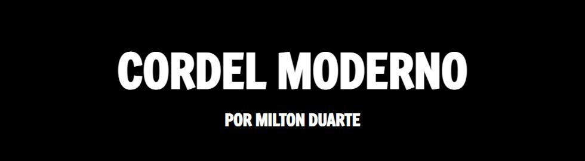

# Projeto Cordel Moderno

[🇺🇸 English](./README.md) | [🇧🇷 Português](./README.pt.md)


Este projeto é um site responsivo criado para exibir o poema "Cordel" de Milton Duarte. Foi desenvolvido como parte do módulo de HTML5 e CSS3 do curso do Cursoemvideo, com foco na criação de um efeito de rolagem parallax e no uso de fontes personalizadas para aprimorar a experiência visual.

[](https://emellybmuniz.github.io/projeto-cordel/)

---
### 📋 Índice

- [Visão Geral do Projeto](#-vis%C3%A3o-geral-do-projeto)
- [Destaques e Funcionalidades](#-destaques-e-funcionalidades)
- [Tecnologias Utilizadas](#-tecnologias-utilizadas)
- [Pré-requisitos](#-pr%C3%A9-requisitos)
- [Instalação](#-instala%C3%A7%C3%A3o)
- [Contribuição](#-contribui%C3%A7%C3%A3o)
- [Créditos](#-cr%C3%A9ditos)
- [Licença](#-licen%C3%A7a)
- [Autora](#-autora)
---

## 🚀 Visão Geral do Projeto

O projeto "Cordel Moderno" é um site simples, mas elegante, com uma única página, projetado para apresentar um poema no estilo da literatura de cordel brasileira. O objetivo principal foi aplicar técnicas avançadas de CSS, como o efeito parallax, para criar uma experiência de leitura envolvente e visualmente atraente.

## ✨ Destaques e Funcionalidades

- **Rolagem Parallax:** Imagens de fundo em certas seções permanecem fixas enquanto o usuário rola a página (`background-attachment: fixed`), criando um belo efeito de profundidade.
- **Design Responsivo:** O layout e a tipografia são fluidos, adaptando-se a diferentes tamanhos de tela, principalmente por meio do uso de unidades de viewport (`vw`).
- **Tipografia Personalizada:** Utiliza fontes personalizadas do Google Fonts ('Freeman' para o título e 'Dekko' para o poema) para capturar a estética dos folhetos de cordel.
- **Legibilidade Aprimorada:** O texto sobre imagens de fundo é colocado dentro de um contêiner semi-transparente para garantir que permaneça legível mesmo sobre fundos complexos.

## 🛠️ Tecnologias Utilizadas

Este projeto foi construído utilizando as seguintes tecnologias:


## ⚙️ Pré-requisitos

Basta abrir o site no seu navegador preferido e começar a rolar a página para apreciar o poema com os efeitos parallax envolventes e o design visual. Nenhuma configuração ou interação adicional é necessária — apenas mergulhe na experiência.

## 📦 Instalação

```bash
# 1. Clone este repositório
$ git clone https://github.com/emellybmuniz/projeto-cordel.git

# 2. Acesse o diretório do projeto
$ cd projeto-cordel

# 3. Abra no seu navegador 

# Linux
$ xdg-open index.html

# macOS
$ open index.html 

# Windows
$ start index.html 
```

## 🤝 Contribuição

Contribuições são sempre bem-vindas e **muito apreciadas!** Sinta-se à vontade para abrir uma issue ou enviar um pull request.

1. Faça um *Fork* do repositório.
2. Clone seu *fork* para sua máquina: (`git clone https://github.com/seu-usuario/projeto-cordel.git`)
3. Configure o repositório original como upstream *(opcional):*
    ```bash
    git remote add upstream https://github.com/emellybmuniz/projeto-cordel.git
    git fetch upstream
    git checkout main
    git merge upstream/main`
    ```
4. Crie uma nova *branch* (`git checkout -b feature/sua-feature`).
5. Faça o *commit* de suas alterações (`git commit -m 'Adiciona nova feature'`).
6. Faça o *push* para a *branch* (`git push origin feature/sua-feature`).
7. Abra um *Pull Request*.


## 🌟 Créditos

Este projeto foi desenvolvido com base em um desafio do módulo de HTML5 e CSS3 do [Curso em Vídeo](https://www.cursoemvideo.com/), ministrado pelo Professor Gustavo Guanabara. Embora todo o código tenha sido escrito por mim, a ideia e a inspiração para o projeto vieram do curso.


## 🔑 Licença

Este projeto não possui uma licença especificada. Sinta-se à vontade para visualizar o código com fins educacionais, mas por favor, dê os devidos créditos se reutilizar qualquer parte dele.

## ✍️ Autora

Feito por **Emelly Muniz** com ❤️

📬 Entre em contato:
📧 emellybmuniz@gmail.com |
💼 [Linkedin](https://www.linkedin.com/in/emellybmuniz) |
🐙 [Github](https://github.com/emellybmuniz)
